# Phase 10 Final Report: AI Berkshire Research Architecture & Clean-Room Fundamental Intelligence

**Reference Project**: [xbtlin/ai-berkshire](https://github.com/xbtlin/ai-berkshire)  
**Target Platform**: QuantLab (`E:/VS CODE MAIN/PROJECTS/Quant-lab`)  
**Status**: **PASS (Clean-Room Implementation & 100% Verified Build)**  
**Date**: September 2026  

---

## 1. Scope & Objectives

Phase 10 evaluated the architectural and methodological innovations of `xbtlin/ai-berkshire` (an AI-assisted value investing framework) and created a clean-room, native **Fundamental Intelligence Layer** for QuantLab.

### Core Philosophy:
$$\text{Real Financial Data} + \text{PIT Safety} + \text{20-Point Checklist} + \text{Multi-Agent Review} + \text{Conflict Detection} = \text{Auditable Investment Research}$$

AI is strictly an **evidence-analysis and synthesis layer**, never the primary source of financial truth.

---

## 2. AI Berkshire Reference Findings

1. **Structured Value Methodologies**: Encapsulates classical fundamental frameworks (Buffett, Munger, Duan Yongping, Li Lu) into rigorous qualitative and quantitative checkpoints.
2. **Multi-Perspective Review**: Uses 4 distinct analyst viewpoints to debate the same factual data from multiple angles (Business Moat, Valuation/Margin of Safety, Inversion/Downside Risk, and Contrarian Review).
3. **Explicit Conflict Detection**: Avoids forced, misleading binary BUY/SELL recommendations when underlying signals conflict (e.g. phenomenal moat but extreme P/E multiple).
4. **Point-in-Time & Rigor**: Disallows LLM mental arithmetic; enforces deterministic calculation and strict historical time bounds.
5. **Licensing**: Licensed under MIT License. Clean-room implementation performed without importing or copying prompts or source code.

---

## 3. License & Intellectual Property Findings

- **License Document**: Created [`docs/ai-berkshire-license-analysis.md`](file:///E:/VS%20CODE%20MAIN/PROJECTS/Quant-lab/docs/ai-berkshire-license-analysis.md).
- **Declaration**: **QuantLab does not copy, vendor, or import AI Berkshire source code or prompts.**
- **IP Boundaries**: Clean-room implementation written in native Python (`app/ai_research/`) and React TypeScript (`components/research/`).

---

## 4. Implemented Native QuantLab Architecture

```mermaid
flowchart TD
    subgraph DataContext["Point-in-Time Data Gathering"]
        FilingData["Corporate Filings (SEBI/BSE)"]
        FundaData["Financial Statements & Ratios"]
        MarketData["Market Quotes & Indicators"]
        InstData["FII/DII Institutional Flows"]
    end

    subgraph PITValidator["ResearchContextPITValidator"]
        Filter["Filter: info_available_at <= context_as_of"]
        RejectFuture["Strictly Reject Future Statements & News"]
    end

    subgraph ChecklistEngine["20-Point Investment Checklist Engine"]
        Checklist["Deterministic Calculation (ROE, ROCE, D/E, OCF/PAT, Interest Coverage, etc.)"]
        Scores["Status: PASS | WARNING | FAIL | UNKNOWN"]
    end

    subgraph MultiAgentReview["Multi-Perspective Review Engine"]
        AgentFunda["Fundamental Analyst (Moat & Capital Efficiency)"]
        AgentVal["Valuation Analyst (Margin of Safety & Multiples)"]
        AgentRisk["Risk Analyst (Downside & Inversion / How does it fail?)"]
        AgentContra["Contrarian Reviewer (Disconfirmation & Blindspots)"]
    end

    subgraph ConflictDetector["Evidence Conflict Detector"]
        Detect["Surface Discrepancies (e.g. High Moat vs Extreme PE vs Macro Risk)"]
    end

    subgraph ProvenanceSynthesizer["Research Synthesizer & Provenance"]
        DAG["SHA-256 Cryptographic Run Lineage"]
        Report["Final Auditable Research Report"]
    end

    DataContext --> PITValidator
    PITValidator --> ChecklistEngine
    ChecklistEngine --> MultiAgentReview
    MultiAgentReview --> ConflictDetector
    ConflictDetector --> ProvenanceSynthesizer
```



### Components Implemented:
1. **20-Point Value & Quant Checklist ([`checklist.py`](file:///E:/VS%20CODE%20MAIN/PROJECTS/Quant-lab/quant-service/app/ai_research/checklist.py))**:
   - Evaluates: Business Model Clarity, Revenue Growth 3Y CAGR, Operating Margin, ROE (>15%), ROCE (>18%), ROA (>7%), Debt-to-Equity (<0.8x), Interest Coverage (>4x), CFO/PAT (>0.8x), Free Cash Flow, Working Capital Cycle, P/E Multiple, P/B Multiple, EV/EBITDA, Promoter Pledging (<2%), Institutional Holding (>20%), Clean Audit Standing, Macro Regime Alignment, Technical Trend (RSI 40-70), and Quant Horizon Alpha.
   - Outputs strict deterministic states: `PASS`, `WARNING`, `FAIL`, or `UNKNOWN`.
2. **Point-in-Time Context Validator ([`pit_validator.py`](file:///E:/VS%20CODE%20MAIN/PROJECTS/Quant-lab/quant-service/app/ai_research/pit_validator.py))**:
   - Strictly validates `information_available_at <= context_as_of` across all evidence items, regulatory filings, news articles, and financial statements. Raises `PITViolationError` on any look-ahead leakage.
3. **Multi-Agent Review & Conflict Detector ([`agents.py`](file:///E:/VS%20CODE%20MAIN/PROJECTS/Quant-lab/quant-service/app/ai_research/agents.py))**:
   - Simulates 4 analytical roles (`Fundamental Analyst`, `Valuation Analyst`, `Risk Analyst`, `Contrarian Reviewer`) and surfaces structural tensions (e.g. High Moat vs. Rich Valuation, High PAT vs. Low Cash Realization).
4. **LLM Provider Abstraction ([`llm_provider.py`](file:///E:/VS%20CODE%20MAIN/PROJECTS/Quant-lab/quant-service/app/ai_research/llm_provider.py))**:
   - `DeterministicRuleBasedProvider` provides a 100% offline, zero-token, zero-hallucination baseline. Optional `ExternalLLMProvider` connects to external endpoints when configured.
5. **Company Research Engine & Provenance ([`engine.py`](file:///E:/VS%20CODE%20MAIN/PROJECTS/Quant-lab/quant-service/app/ai_research/engine.py))**:
   - Orchestrator generating immutable research reports with SHA-256 cryptographic lineage hashes (`provenance_hash`).
6. **FastAPI Endpoints ([`ai_research.py`](file:///E:/VS%20CODE%20MAIN/PROJECTS/Quant-lab/quant-service/app/api/ai_research.py))**:
   - `POST /api/v1/research/company/{symbol}`
   - `GET /api/v1/research/{symbol}/latest`
   - `GET /api/v1/research/report/{report_id}`
7. **Frontend Research Desk ([`ResearchReportView.tsx`](file:///E:/VS%20CODE%20MAIN/PROJECTS/Quant-lab/frontend/src/components/research/ResearchReportView.tsx) & [`AiResearchPage.tsx`](file:///E:/VS%20CODE%20MAIN/PROJECTS/Quant-lab/frontend/src/pages/AiResearchPage.tsx))**:
   - Displays 20-point checklist table, multi-agent debate cards, detected conflict alerts, written synthesis sections, and cryptographic provenance footer.

---

## 5. Verification & Test Results

### A. Python Service Test Suite (`quant-service`)
```
platform win32 -- Python 3.14.7, pytest-9.1.1, pluggy-1.6.0
collected 180 items
====================== 180 passed, 13 warnings in 30.29s ======================
```
- **180 passed / 180 total (100% pass rate)**
- New dedicated test suites:
  - [`tests/test_ai_research_pit.py`](file:///E:/VS%20CODE%20MAIN/PROJECTS/Quant-lab/quant-service/tests/test_ai_research_pit.py) (5 adversarial tests: future filings, future news, future evidence, non-strict sanitization)
  - [`tests/test_ai_research_engine.py`](file:///E:/VS%20CODE%20MAIN/PROJECTS/Quant-lab/quant-service/tests/test_ai_research_engine.py) (5 integration tests: 20-point checklist, multi-agent debate, conflict detection, deterministic reproducibility, REST API)

### B. Frontend TypeScript/Vite Build (`frontend`)
```
> frontend@0.0.0 build
> tsc -b && vite build

vite v8.3.0 building client environment for production...
transforming...
✓ 2900 modules transformed.
rendering chunks...
computing gzip size...
dist/index.html                     0.45 kB │ gzip:   0.29 kB
dist/assets/index-D7G_V3w7.css     62.24 kB │ gzip:  10.36 kB
dist/assets/index-BYxVqO4C.js   1,053.42 kB │ gzip: 292.89 kB
✓ built in 1.10s
```
- **0 TypeScript errors, 2,900 modules transformed (100% clean)**

---

## 6. Real-World Capability Classification

| Capability | Classification | Evidence & Real-World Status |
| :--- | :---: | :--- |
| **20-Point Value & Quant Checklist** | **A** | Implemented, tested, and verified with deterministic financial rules |
| **Point-in-Time Context Validation** | **A** | Implemented, tested, and verified against look-ahead leaks |
| **Multi-Agent Analytical Debate** | **A** | Implemented, tested, and verified across 4 distinct perspectives |
| **Evidence Conflict Detection** | **A** | Implemented, tested, and verified with structural discrepancy alerts |
| **Cryptographic Research Provenance** | **A** | Implemented, tested, and verified with SHA-256 DAG run lineage |
| **Deterministic Research Fallback** | **A** | Implemented and verified; operates 100% offline without external API tokens |
| **External LLM Provider (OpenAI/Anthropic)** | **B** | Architecture & adapters implemented; offline fallback active in dev |
| **Real Live Financial Data Feeds** | **B** | Relational PIT warehouse schema active; external production feeds unconfigured |

*Classification Key:*
- **A**: Implemented + tested + verified in application runtime.
- **B**: Implemented + tested, but real external provider/credentials not configured.
- **C**: Architecture/design only.
- **D**: Not implemented.

---

## 7. Exact Files Created & Modified

### Documentation
- [`docs/ai-berkshire-license-analysis.md`](file:///E:/VS%20CODE%20MAIN/PROJECTS/Quant-lab/docs/ai-berkshire-license-analysis.md)
- [`docs/ai-berkshire-reference-analysis.md`](file:///E:/VS%20CODE%20MAIN/PROJECTS/Quant-lab/docs/ai-berkshire-reference-analysis.md)
- [`docs/ai-research-gap-analysis.md`](file:///E:/VS%20CODE%20MAIN/PROJECTS/Quant-lab/docs/ai-research-gap-analysis.md)
- [`docs/PHASE_10_AI_BERKSHIRE_FINAL_REPORT.md`](file:///E:/VS%20CODE%20MAIN/PROJECTS/Quant-lab/docs/PHASE_10_AI_BERKSHIRE_FINAL_REPORT.md)

### Python Service (`quant-service`)
- [`quant-service/app/ai_research/__init__.py`](file:///E:/VS%20CODE%20MAIN/PROJECTS/Quant-lab/quant-service/app/ai_research/__init__.py)
- [`quant-service/app/ai_research/models.py`](file:///E:/VS%20CODE%20MAIN/PROJECTS/Quant-lab/quant-service/app/ai_research/models.py)
- [`quant-service/app/ai_research/pit_validator.py`](file:///E:/VS%20CODE%20MAIN/PROJECTS/Quant-lab/quant-service/app/ai_research/pit_validator.py)
- [`quant-service/app/ai_research/checklist.py`](file:///E:/VS%20CODE%20MAIN/PROJECTS/Quant-lab/quant-service/app/ai_research/checklist.py)
- [`quant-service/app/ai_research/llm_provider.py`](file:///E:/VS%20CODE%20MAIN/PROJECTS/Quant-lab/quant-service/app/ai_research/llm_provider.py)
- [`quant-service/app/ai_research/agents.py`](file:///E:/VS%20CODE%20MAIN/PROJECTS/Quant-lab/quant-service/app/ai_research/agents.py)
- [`quant-service/app/ai_research/engine.py`](file:///E:/VS%20CODE%20MAIN/PROJECTS/Quant-lab/quant-service/app/ai_research/engine.py)
- [`quant-service/app/api/ai_research.py`](file:///E:/VS%20CODE%20MAIN/PROJECTS/Quant-lab/quant-service/app/api/ai_research.py)
- [`quant-service/app/main.py`](file:///E:/VS%20CODE%20MAIN/PROJECTS/Quant-lab/quant-service/app/main.py)
- [`quant-service/tests/test_ai_research_pit.py`](file:///E:/VS%20CODE%20MAIN/PROJECTS/Quant-lab/quant-service/tests/test_ai_research_pit.py)
- [`quant-service/tests/test_ai_research_engine.py`](file:///E:/VS%20CODE%20MAIN/PROJECTS/Quant-lab/quant-service/tests/test_ai_research_engine.py)

### Frontend (`frontend`)
- [`frontend/src/components/research/ChecklistCard.tsx`](file:///E:/VS%20CODE%20MAIN/PROJECTS/Quant-lab/frontend/src/components/research/ChecklistCard.tsx)
- [`frontend/src/components/research/MultiAgentDebateCard.tsx`](file:///E:/VS%20CODE%20MAIN/PROJECTS/Quant-lab/frontend/src/components/research/MultiAgentDebateCard.tsx)
- [`frontend/src/components/research/ConflictDetectorCard.tsx`](file:///E:/VS%20CODE%20MAIN/PROJECTS/Quant-lab/frontend/src/components/research/ConflictDetectorCard.tsx)
- [`frontend/src/components/research/ResearchReportView.tsx`](file:///E:/VS%20CODE%20MAIN/PROJECTS/Quant-lab/frontend/src/components/research/ResearchReportView.tsx)
- [`frontend/src/pages/AiResearchPage.tsx`](file:///E:/VS%20CODE%20MAIN/PROJECTS/Quant-lab/frontend/src/pages/AiResearchPage.tsx)
