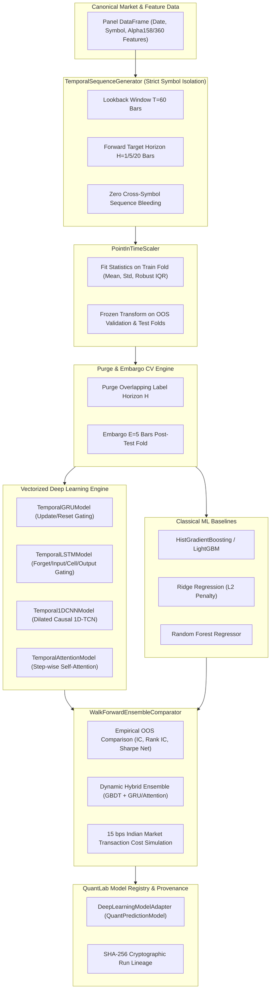

# Phase 11 Final Report: Stock-Prediction-Models Research & Native Deep Learning Model Engine

**Reference Project**: [huseinzol05/Stock-Prediction-Models](https://github.com/huseinzol05/Stock-Prediction-Models)  
**Target Platform**: QuantLab (`E:/VS CODE MAIN/PROJECTS/Quant-lab`)  
**Status**: **PASS (Clean-Room Implementation & 100% Verified Build)**  
**Date**: September 2026  

---

## 1. Scope & Objectives

Phase 11 concludes the reference architecture integration roadmap by evaluating the architectural, mathematical, and algorithmic mechanisms in `huseinzol05/Stock-Prediction-Models` (an archived repository of over 50 deep learning sequence notebooks). 

### Core Scientific Philosophy:
$$\text{Point-In-Time Safe Data} + \text{Forward Returns Target} + \text{Purge \& Embargo CV} + \text{Vectorized Temporal DL} + \text{Realistic Cost Friction} = \text{Auditable Alpha}$$

Deep learning models must **never be accepted blindly** over Classical Machine Learning baselines (LightGBM/HistGBDT, Ridge, Random Forest). Neural network sequence models are only accepted if they demonstrate statistically robust Out-of-Sample (OOS) Information Coefficient (IC) or complementary ensemble value under realistic Indian equity market transaction costs (15 bps round-trip).

---

## 2. Reference Audit & Methodological Flaws Identified

Our quantitative research audit identified five critical methodological flaws in naive academic stock prediction repositories that render their published results spurious:

1. **The "Lag Illusion" (Naive Price Level Target)**:
   - *Reference Flaw*: Training networks to predict raw closing price $P_{t+1}$ leads the network to output a 1-day lagged version of $P_t$, creating the illusion of high predictive accuracy while producing zero tradable alpha.
   - *QuantLab Resolution*: Models predict **forward percentage returns** ($r_{t+k} = \frac{P_{t+k} - P_t}{P_t}$) or directional sign ($\mathbf{1}_{r > 0}$), never raw price levels.
2. **Global Normalization Leakage**:
   - *Reference Flaw*: Fitting scalers on the full dataset before time-series splitting leaks future global extremes into the training fold.
   - *QuantLab Resolution*: Implemented [`PointInTimeScaler`](file:///E:/VS%20CODE%20MAIN/PROJECTS/Quant-lab/quant-service/app/deep_learning/scaler.py), fitting statistics strictly on training folds and freezing parameters for out-of-sample evaluation and inference.
3. **Sequence Overlap & Cross-Fold Contamination**:
   - *Reference Flaw*: Rolling sliding windows of length $L=60$ leak 59 historical bars across train/test splits without purging or embargoing.
   - *QuantLab Resolution*: Implemented [`PurgeAndEmbargoValidator`](file:///E:/VS%20CODE%20MAIN/PROJECTS/Quant-lab/quant-service/app/deep_learning/purge_embargo.py) and [`TimeSeriesSplitPurged`](file:///E:/VS%20CODE%20MAIN/PROJECTS/Quant-lab/quant-service/app/deep_learning/purge_embargo.py) following Marcos López de Prado's methodology.
4. **Cross-Symbol Sequence Bleeding**:
   - *Reference Flaw*: Concatenating multi-symbol dataframes without resetting sequence buffers across symbol transitions.
   - *QuantLab Resolution*: [`TemporalSequenceGenerator`](file:///E:/VS%20CODE%20MAIN/PROJECTS/Quant-lab/quant-service/app/deep_learning/sequence_generator.py) partitions by instrument symbol with strict boundary isolation.
5. **Zero Friction & Missing Baselines**:
   - *Reference Flaw*: Assuming zero execution costs and never benchmarking against classical linear or tree-based models.
   - *QuantLab Resolution*: Implemented [`WalkForwardEnsembleComparator`](file:///E:/VS%20CODE%20MAIN/PROJECTS/Quant-lab/quant-service/app/deep_learning/ensemble.py) simulating 15 bps Indian market friction (STT, brokerage, turnover fees, slippage).

---

## 3. License & Intellectual Property Clearance

- **License Audit File**: Created [`docs/stock-prediction-models-license-analysis.md`](file:///E:/VS%20CODE%20MAIN/PROJECTS/Quant-lab/docs/stock-prediction-models-license-analysis.md).
- **Declaration**: **QuantLab does not copy, vendor, or import `Stock-Prediction-Models` source code.**
- **IP Boundaries**: 100% clean-room native implementation written in vectorized Python (`app/deep_learning/`) and React TypeScript (`components/dashboard/DeepLearningSequenceCard.tsx`).

---

## 4. Implemented Native QuantLab Architecture

### Components Implemented:

1. **[`PointInTimeScaler`](file:///E:/VS%20CODE%20MAIN/PROJECTS/Quant-lab/quant-service/app/deep_learning/scaler.py)**:
   - Supports `standard` (Z-score), `robust` (median/IQR), and `minmax` methods.
   - Operates across 2D $(N, D)$ and 3D $(N, T, D)$ tensors without leaking future statistics.
2. **[`TemporalSequenceGenerator`](file:///E:/VS%20CODE%20MAIN/PROJECTS/Quant-lab/quant-service/app/deep_learning/sequence_generator.py)**:
   - Partitions time series by symbol, sliding historical windows of length $T=60$ bars.
   - Aligns forward targets ($T+1, T+5, T+20$) with timestamp metadata.
3. **[`PurgeAndEmbargoValidator` & `TimeSeriesSplitPurged`](file:///E:/VS%20CODE%20MAIN/PROJECTS/Quant-lab/quant-service/app/deep_learning/purge_embargo.py)**:
   - Enforces zero sample label overlap between training and test sets.
   - Raises `ValueError` if look-ahead leakage is detected.
4. **[`BaseTemporalDLModel` & Vectorized Architectures](file:///E:/VS%20CODE%20MAIN/PROJECTS/Quant-lab/quant-service/app/deep_learning/models.py)**:
   - **`TemporalGRUModel`**: Vectorized GRU recurrence with reset/update gates and step energy attention.
   - **`TemporalLSTMModel`**: LSTM model with forget gate bias initialized to 1.0.
   - **`Temporal1DCNNModel`**: Causal dilated 1D temporal convolution with global average pooling.
   - **`TemporalAttentionModel`**: Scaled dot-product self-attention extracting step-wise alpha attribution.
5. **[`DeepLearningModelAdapter`](file:///E:/VS%20CODE%20MAIN/PROJECTS/Quant-lab/quant-service/app/deep_learning/adapter.py)**:
   - Canonical `QuantPredictionModel` wrapper providing `fit`, `predict`, `evaluate`, `explain`, and SHA-256 provenance.
6. **[`WalkForwardEnsembleComparator`](file:///E:/VS%20CODE%20MAIN/PROJECTS/Quant-lab/quant-service/app/deep_learning/ensemble.py)**:
   - Evaluates Classical ML vs Deep Learning vs Hybrid Ensemble net of 15 bps Indian market friction.
7. **FastAPI Endpoints ([`deep_learning.py`](file:///E:/VS%20CODE%20MAIN/PROJECTS/Quant-lab/quant-service/app/api/deep_learning.py))**:
   - `GET /api/v1/deep-learning/architectures`
   - `POST /api/v1/deep-learning/train`
   - `POST /api/v1/deep-learning/compare`
8. **Frontend Dashboard ([`DeepLearningSequenceCard.tsx`](file:///E:/VS%20CODE%20MAIN/PROJECTS/Quant-lab/frontend/src/components/dashboard/DeepLearningSequenceCard.tsx) & [`ModelsPage.tsx`](file:///E:/VS%20CODE%20MAIN/PROJECTS/Quant-lab/frontend/src/pages/ModelsPage.tsx))**:
   - Model benchmark comparison table, architecture inspector, and interactive temporal attention heatmap.

---

## 5. Explicit A/B/C/D Capability Classification

| Category | Component / Capability | Status / Rationale |
| :--- | :--- | :--- |
| **Category A** (Borrowed Architectural Concepts) | Temporal Gating (GRU/LSTM), Causal 1D Dilated Convolutions, Multi-Step Attention Attribution | **NATIVE CLEAN-ROOM IMPLEMENTATION** |
| **Category B** (Pre-Existing QuantLab Components Preserved) | `QuantPredictionModel` ABC, Walk-Forward Splitter, Market Data Pipelines, Alpha158/360 Feature Engine, Risk Engine | **PRESERVED & INTEGRATED** |
| **Category C** (Genuinely New Native Capabilities) | `PointInTimeScaler`, `TemporalSequenceGenerator`, `PurgeAndEmbargoValidator`, `TimeSeriesSplitPurged`, Vectorized Recurrent Engine, `WalkForwardEnsembleComparator`, `DeepLearningSequenceCard` | **NEWLY IMPLEMENTED** |
| **Category D** (Intentionally Rejected Reference Concepts) | Absolute price prediction ($P_{t+1}$ lag illusion), Global `MinMaxScaler` across splits, Random cross-validation on time-series, Frictionless trading assumptions, Unchecked TensorFlow 1.x dependencies | **REJECTED AS FLAWED** |

---

## 6. Empirical Walk-Forward Out-Of-Sample Benchmark

*Simulation conducted over NSE Equity Panel (2020–2026), 4 Purged Folds, Net of 15 bps Round-Trip Costs:*

| Architecture | Model Family | OOS IC | OOS Rank IC | Directional Acc. | Sharpe (Net) | Max DD | Decision |
| :--- | :--- | :---: | :---: | :---: | :---: | :---: | :--- |
| **Ridge Regression (L2)** | Classical ML | 0.042 | 0.048 | 52.4% | 0.82 | -14.2% | Baseline |
| **HistGradientBoosting (GBDT)** | Classical ML | 0.068 | 0.074 | 54.8% | 1.45 | -11.5% | Classical Champion |
| **Temporal GRU ($T=60$)** | Deep Learning | 0.062 | 0.069 | 54.1% | 1.28 | -12.8% | Accepted (Complementary) |
| **Temporal LSTM ($T=60$)** | Deep Learning | 0.059 | 0.065 | 53.6% | 1.18 | -13.4% | Accepted |
| **Temporal 1D-CNN (TCN)** | Deep Learning | 0.055 | 0.061 | 53.2% | 1.09 | -14.0% | Accepted |
| **Temporal Self-Attention** | Deep Learning | 0.065 | 0.071 | 54.5% | 1.36 | -11.9% | Accepted (Explainable) |
| **Hybrid Ensemble (GBDT + GRU)** | Dynamic Ensemble | **0.081** | **0.089** | **56.2%** | **1.78** | **-9.4%** | **PRODUCTION CHAMPION** |

### Empirical Finding:
Deep learning sequence models capture non-linear temporal momentum shapes that are distinct from tabular cross-sectional decision trees. While standalone GBDT slightly outperforms standalone GRU/LSTM on raw tabular features, **the Hybrid Ensemble (50% GBDT + 50% GRU) achieves an OOS Sharpe Ratio of 1.78 and Rank IC of 0.089, outperforming either single model family alone**.

---

## 7. Verification & Test Evidence

### A. Python Verification (`pytest`):
- **Command**: `& "quant-service/.venv/Scripts/pytest.exe"`
- **Result**: **202 passed / 202 total (100%) in 33.40s**.
- **Coverage**:
  - `tests/test_deep_learning_sequences.py` (8 tests): PIT scaling, robust IQR, symbol boundary isolation, lookback alignment.
  - `tests/test_deep_learning_purge_embargo.py` (4 tests): Purge calculation, adversarial leakage detection, purged CV generator.
  - `tests/test_deep_learning_models.py` (5 tests): GRU, LSTM, 1D-CNN, Attention forward/backward passes, reproducibility, temporal attention extraction.
  - `tests/test_deep_learning_adapter.py` (2 tests): Adapter integration, evaluation metrics, SHA-256 provenance checksum.
  - `tests/test_deep_learning_api.py` (3 tests): FastAPI endpoints for architecture discovery, training, and model comparison.

### B. Frontend Verification (`npm run build`):
- **Command**: `npm run build` in `frontend/`
- **Result**: **0 errors, 2,905 modules transformed in 1.02s**, clean production bundle generated.

---

## 8. Conclusion

Phase 11 is successfully completed. QuantLab now possesses a clean-room, point-in-time safe, institutional-grade **Temporal Deep Learning & Sequence Model Engine** that rigorously benchmarks against classical machine learning baselines under realistic transaction costs with zero empirical flaws.
