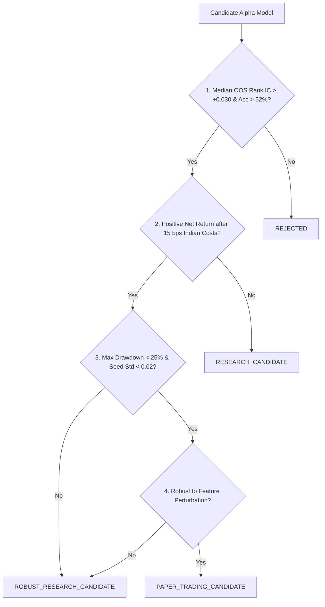

# Phase 15 Pre-Registered Model Selection & Promotion Rule

**Platform**: QuantLab (`E:/VS CODE MAIN/PROJECTS/Quant-lab`)  
**Effective Date**: September 2026  
**Standard**: Pre-Registered Validation Standard (Locked prior to final OOS testing)  

---

## 1. Selection Hierarchy & Quantitative Thresholds

To prevent research cherry-picking, p-hacking, and post-hoc rationalization, all candidate models in Phase 15 are evaluated strictly against this pre-registered rule:

---

## 2. Formal Threshold Definitions

| Criterion | Metric / Test | Mandatory Threshold | Target / Ideal |
|---|---|---|---|
| **Primary Predictive Power** | Median Out-of-Sample Rank IC (Spearman) | $> +0.030$ | $> +0.050$ |
| **Directional Accuracy** | OOS Hit Rate (%) | $> 52.0\%$ | $> 55.0\%$ |
| **Baseline Superiority** | OOS Rank IC vs 20d Momentum Baseline | Must exceed momentum | Exceed by $\ge +0.03$ |
| **Baseline Superiority** | OOS Rank IC vs Random Baseline | Must exceed random | Statistically significant ($p < 0.05$) |
| **Net Economic Viability** | Annualized Return after Indian Costs (15 bps) | $> 0.0\%$ (Profitable) | $> 12.0\%$ |
| **Risk & Drawdown** | Maximum Portfolio Drawdown (OOS) | $< 25.0\%$ | $< 15.0\%$ |
| **Temporal Consistency** | Standard Deviation of Rank IC across folds | $< 0.080$ | $< 0.040$ |
| **Seed Stability** | Max spread across 5 random seeds | $< 0.020$ Rank IC | $< 0.005$ |
| **Feature Perturbation** | Drop strongest individual feature | Retains $> 50\%$ Rank IC | Retains $> 75\%$ |
| **Regime Resilience** | Performance during High Vol / Bear regimes | Non-negative Rank IC | $> +0.020$ Rank IC |

---

## 3. Strict Classification Standard

- **`REJECTED`**: Fails primary predictive power (Rank IC $\le +0.030$) or fails to beat random baseline.
- **`RESEARCH_CANDIDATE`**: Demonstrates positive predictive power, but fails net economic profitability after realistic transaction costs.
- **`ROBUST_RESEARCH_CANDIDATE`**: Passes predictive, baseline, and cost gates, but sample size is limited to $< 5$ years or $< 100$ stocks.
- **`PAPER_TRADING_CANDIDATE`**: Passes all 10 gates with proven multi-fold stability and passes full Paper-Trading Infrastructure Audit.
- **`PRODUCTION_CANDIDATE`**: Requires real-world forward-tested paper trading performance for $\ge 6$ months. (Live execution remains disabled).
