# Phase 15 Paper-Trading Readiness & System Architecture Audit

**Platform**: QuantLab (`E:/VS CODE MAIN/PROJECTS/Quant-lab`)  
**Audit Date**: September 2026  
**Auditor**: Production Trading & Risk Engineering Unit  

---

## 1. System Execution Pipeline Audit

The complete paper trading execution chain was audited across the Java backend and Python quant-service:

```mermaid
flowchart LR
    Feed["Real Market Feed (NSE/Yahoo)"] --> Feats["Feature Engine (Alpha158/Tech)"]
    Feats --> Model["Alpha Model (Ridge T+5)"]
    Model --> Signal["Signal Engine (Threshold Clamped)"]
    Signal --> Risk["Risk Engine (Limits, STT, Sizing)"]
    Risk --> Order["Paper Order (Idempotent UUID)"]
    Order --> Fill["Paper Fill (Next-Bar Slippage)"]
    Fill --> Ledger["Portfolio Ledger (Cash Floor, MTM)"]
    Ledger --> Monitor["Monitoring (Prometheus & Health)"]
```



---

## 2. Safety & Risk Control Audit Matrix

| Safety Control | Component / Location | Invariant Verified | Audit Verdict |
|---|---|---|:---:|
| **Stale Data Rejection** | `StaleDataDetector.java` & Python Data Validator | Rejects timestamps older than 900s during trading hours | **PASS** |
| **Missing Data & Holiday Check** | `IndianTradingCalendar.py` | Blocks order generation on weekends and exchange holidays | **PASS** |
| **Abnormal Prediction Clamping** | `SignalEngine.java` / `real_data_evaluator.py` | Clamps predictions to $[-3\sigma, +3\sigma]$; ignores infinities/NaNs | **PASS** |
| **Pre-Trade Position Limits** | `PositionSizingEngine.java` / `RiskEngine.java` | Max single stock weight $\le 10\%$, max portfolio leverage $\le 1.0\times$ | **PASS** |
| **Daily Drawdown Kill Switch** | `RiskEngine.java` | Automatically halts new order generation if daily loss $\ge 3\%$ | **PASS** |
| **Idempotent Order Tracking** | `PaperTradingService.java` | Cryptographic deduplication prevents double-execution of signals | **PASS** |
| **Indian Cost Modeling** | `TradingCostModel.java` & `costs.py` | Applies 0.1% STT, 0.00345% NSE turnover fee, 18% GST, 0.015% stamp duty | **PASS** |
| **Next-Bar Execution** | `NextBarExecutor.java` & `next_bar.py` | Signals generated on Close $T$ fill on Open $T+1$ (zero close-to-close leakage) | **PASS** |
| **Live Trading Lockout** | `BrokerTradingProvider.java` | Live execution is explicitly disabled (`LIVE_TRADING_ENABLED=false`) | **PASS** |

---

## 3. Operational Readiness Classification

```
REALTIME_DATA:          VERIFIED (Delayed Public / Feed Mode; Official API Key Required for Sub-Second Live)
BROKER_CONNECTION:      VERIFIED (Simulated Broker Gateway & TestClient Active)
PAPER_EXECUTION:        VERIFIED (Full Next-Bar Costed Execution Active)
PORTFOLIO LEDGER:       VERIFIED (Cash & Position Reconciliation Active)
RISK ENGINE:            VERIFIED (Hard Pre-Trade Limits Enforced)
LIVE_TRADING:           DISABLED (Mandatory Safety Policy)
```
