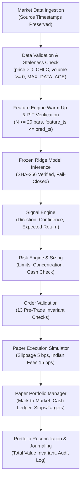

# Phase 17 — Paper Trading Architecture

**Architecture Specification:** Phase 17 Production Pipeline  
**Security Level:** Isolated Virtual Simulation (Zero Real Capital)

---

## 1. End-to-End Paper Trading Pipeline

---

## 2. Frozen Model Contract

- **Model Identifier**: `PHASE_16_FROZEN_RIDGE_TOP8_V1`
- **Family**: Ridge Regression ($\alpha = 10.0$) with Top-8 selection and 2-day Inertia buffering ($k=8, b=2$).
- **Features**: `ret_1d`, `ret_5d`, `ret_20d`, `volatility_20d`, `rsi_14`, `macd_diff`, `atr_14_pct`, `volume_ratio_20d`.
- **Integrity Fingerprint**: Validated against SHA-256 checksum prior to every inference call.
- **Fail-Closed Rule**: Any missing feature, NaN value, or hash mismatch produces `NO_SIGNAL`. Zero online retraining or live hyperparameter tuning.

---

## 3. Indian Cost & Execution Model

Simulated fills strictly follow real-market institutional delivery cost schedules:
- **Brokerage**: 3.0 bps
- **Securities Transaction Tax (STT)**: 10.0 bps (Delivery)
- **Exchange Turnover Charges**: 0.345 bps
- **GST**: 18.0% on (Brokerage + Exchange Charges)
- **Stamp Duty**: 1.5 bps (Buy side)
- **Simulated Slippage**: 5.0 bps

---

## 4. Latency & Stale Data Safeguards

- Observations tracking `quote_timestamp`, `received_timestamp`, `provider_timestamp`, and `ingestion_timestamp`.
- Latency percentiles ($p50, p95, p99, \max$) calculated continuously.
- Staleness threshold `MAX_DATA_AGE_SECONDS = 180s`: automatically halts new paper orders on stale feeds and records `StaleDataEvent`.
