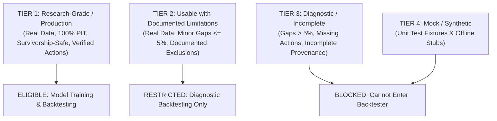

# QuantLab Research Data Contract & Dataset Tiering Standard

**Platform**: QuantLab (`E:/VS CODE MAIN/PROJECTS/Quant-lab`)  
**Standard Version**: v1.0.0  
**Effective Date**: September 2026  

---

## 1. Purpose & Guarantees

This contract establishes mandatory mathematical, temporal, and provenance requirements that any financial dataset must satisfy before it can be consumed by:
1. **Model Training & Alpha Research** (`QuantPredictionModel`, Qlib Pipeline, Deep Learning Engine)
2. **Walk-Forward Validation & Cross-Validation** (`TimeSeriesSplitPurged`, `WalkForwardEnsembleComparator`)
3. **Backtesting & Simulation** (`BacktestEngine`, `CorporateActionAdjustmentService`)
4. **Paper Trading & Live Execution**

Any dataset failing critical requirements of this contract is automatically blocked by the **Dataset Readiness Gate**.

---

## 2. Dataset Classification Tiers

### Tier Definitions:

| Tier Level | Name | Permitted Usages | Required Standard |
|---|---|---|---|
| **TIER 1** | **Research-Grade** | Production Backtesting, Model Training, Walk-Forward CV | • Genuine real-world market feeds • 100% Point-in-Time safe (`information_available_at` enforced) • Survivorship-bias-free universe (`universe(as_of)`) • Immutable raw price storage + deterministic corporate action factors • Calendar session completeness $\ge 95\%$ • Complete provenance (`ingestion_run_id`, SHA-256 checksum, dataset version) |
| **TIER 2** | **Usable (Limited)** | Exploratory Research, Diagnostic Testing | • Real data with minor documented gaps (completeness $90\% - 95\%$) • Limitations explicitly reported in dataset metadata |
| **TIER 3** | **Diagnostic / Incomplete** | Pipeline Testing, Gap Analysis | • Incomplete history, missing corporate actions, or unverified provenance • **STRICTLY BLOCKED** from Alpha Training and Production Backtesting |
| **TIER 4** | **Mock / Synthetic** | Offline Unit Tests only | • Synthetic fixtures and simulated stubs • **STRICTLY BLOCKED** in `REAL_DATA` mode |

---

## 3. Mandatory Invariant Rules

1. **Point-In-Time Invariance**: For any historical decision bar at timestamp $T$, no feature, label, filing, financial statement, or corporate action whose `information_available_at > T` may be utilized.
2. **Raw Price Immutability**: Raw OHLCV records must never be modified in-place when corporate actions occur. All adjustments must be stored as separate fields (`adj_open`, `adj_high`, `adj_low`, `adj_close`) with explicit `cumulative_split_factor` and `cumulative_dividend_factor`.
3. **No Retrospective Universe Conditioning**: Historical universes must be queried dynamically as `universe(as_of)`. Using today's index constituents for historical years is a catastrophic violation.
4. **No Synthetic Fallback**: In `REAL_DATA` mode, any unavailable provider must raise an immediate exception. Returning synthetic prices under the guise of real data is strictly prohibited.
5. **Cryptographic Provenance**: Every dataset snapshot must carry an immutable `dataset_version` string and a SHA-256 checksum computed over the dataset records.
