# AI Fundamental Research Gap Analysis & Integration Blueprint

**Target Platform**: QuantLab (`E:/VS CODE MAIN/PROJECTS/Quant-lab`)  
**Phase**: Phase 10 — Fundamental Intelligence Layer  
**Date**: September 2026  

---

## 1. Current State of QuantLab (Pre-Phase 10)

QuantLab already possesses strong fundamental, market data, and risk infrastructures:
- **Java Backend**:
  - `FundamentalIntelligenceController` (`/api/v1/fundamentals/company/{symbol}`, `/statements/{symbol}`, `/ratios/{symbol}`, `/filings/{symbol}`)
  - `NewsController` (`/api/v1/news/timeline/{symbol}`, `/articles/{symbol}`, `/events/{symbol}`)
  - `InstitutionalIntelligenceController` (`/api/v1/institutional/...`)
  - `MarketDataController` & `GlobalMarketIntelligenceController`
- **Python Service (`quant-service`)**:
  - Technical indicator engine, Alpha158/360 adapters, PIT lookahead scanners, walk-forward validator, risk engine, horizon models.
- **Frontend**:
  - `StockResearchWorkspace`, `CompanyFundamentalsCard`, `SignalTerminalCard`, `MarketIntelligenceTerminalPage`.

### Identified Gaps:
1. **No Structured Investment Checklist Engine**: No automated 20-point value investing checklist evaluating capital efficiency, leverage, cash flow quality, and corporate governance for Indian equities.
2. **No Point-in-Time Research Context Validator**: No mechanism to package a security's historical filings, financial ratios, and market context while guaranteeing zero future leakage beyond `context_as_of`.
3. **No Multi-Perspective Review / Conflict Detector**: No automated multi-agent review surfacing structural tensions (e.g. strong fundamentals vs. excessive valuation vs. high macro volatility).
4. **No LLM Provider Abstraction with Deterministic Fallback**: No unified provider layer that operates gracefully with OpenAI/Anthropic/DeepSeek or falls back to 100% deterministic rule-based analysis when no LLM is configured.
5. **No Cryptographic Research Run Provenance**: No persistent SHA-256 DAG tracking of research reports, prompts, evidence items, and checklist versions.

---

## 2. Native QuantLab Implementation Blueprint

```mermaid
flowchart TD
    subgraph DataContext["Point-in-Time Data Gathering"]
        FilingData["Corporate Filings (SEBI/BSE)"]
        FundaData["Financial Statements & Ratios"]
        MarketData["Market Quotes & Indicators"]
        InstData["FII/DII Institutional Flows"]
    end

    subgraph PITValidator["ResearchContextPITValidator"]
        Filter["Filter: info_available_at <= context_as_of"]
        RejectFuture["Strictly Reject Future Statements & News"]
    end

    subgraph ChecklistEngine["20-Point Investment Checklist Engine"]
        Checklist["Deterministic Calculation (ROE, ROCE, D/E, OCF/PAT, Interest Coverage, etc.)"]
        Scores["Status: PASS | WARNING | FAIL | UNKNOWN"]
    end

    subgraph MultiAgentReview["Multi-Perspective Review Engine"]
        AgentFunda["Fundamental Analyst (Moat & Capital Efficiency)"]
        AgentVal["Valuation Analyst (Margin of Safety & Multiples)"]
        AgentRisk["Risk Analyst (Downside & Inversion / How does it fail?)"]
        AgentContra["Contrarian Reviewer (Disconfirmation & Blindspots)"]
    end

    subgraph ConflictDetector["Evidence Conflict Detector"]
        Detect["Surface Discrepancies (e.g. High Moat vs Extreme PE vs Macro Risk)"]
    end

    subgraph ProvenanceSynthesizer["Research Synthesizer & Provenance"]
        DAG["SHA-256 Cryptographic Run Lineage"]
        Report["Final Auditable Research Report"]
    end

    DataContext --> PITValidator
    PITValidator --> ChecklistEngine
    ChecklistEngine --> MultiAgentReview
    MultiAgentReview --> ConflictDetector
    ConflictDetector --> ProvenanceSynthesizer
```

---

## 3. Detailed Component Plan

1. **`app/ai_research/models.py`**:
   - `ResearchReport`, `ResearchSection`, `ResearchClaim`, `ResearchEvidence`, `ResearchSource`, `ResearchRun`, `ChecklistItem`, `ChecklistStatus`, `MultiAgentReview`, `ConflictReport`.
2. **`app/ai_research/pit_validator.py`**:
   - `ResearchContextPITValidator` verifying timestamps on all evidence items.
3. **`app/ai_research/checklist.py`**:
   - 20-point value checklist:
     1. Business Model Comprehensibility
     2. Revenue Growth Consistency (>10% 3Y CAGR)
     3. Operating Profit Margin Stability (>15%)
     4. Return on Equity (ROE > 15%)
     5. Return on Capital Employed (ROCE > 18%)
     6. Return on Assets (ROA > 7%)
     7. Debt-to-Equity Ratio (< 1.0)
     8. Interest Coverage Ratio (> 4.0x)
     9. Cash Flow from Operations to Net Profit (> 0.8x)
     10. Free Cash Flow Positive (> 0)
     11. Working Capital Days Stability
     12. Price-to-Earnings Valuation Relative to Growth (PEG < 2.0)
     13. Price-to-Book vs ROE Alignment
     14. Enterprise Value to EBITDA (< 20x)
     15. Promoter Pledging (< 5%)
     16. Institutional Ownership Trend (Stable or Increasing)
     17. Corporate Governance & Clean Audit Report
     18. Market Regime Alignment (Not in severe high-vol risk-off)
     19. Technical Trend & Momentum Confirmation
     20. Quant Horizon Model Alpha Confirmation
4. **`app/ai_research/llm_provider.py`**:
   - `ResearchLLMProvider` interface + `DeterministicRuleBasedProvider` (primary offline fallback) + `OpenAICompatibleProvider`.
5. **`app/ai_research/agents.py`**:
   - `FundamentalAnalyst`, `ValuationAnalyst`, `RiskAnalyst`, `ContrarianReviewer`, `EvidenceConflictDetector`.
6. **`app/ai_research/engine.py`**:
   - `CompanyResearchEngine` orchestrating validation, checklist scoring, multi-agent debate, conflict resolution, and cryptographic SHA-256 run hashing.
7. **`app/api/ai_research.py`**:
   - REST endpoints: `POST /api/v1/research/company/{symbol}`, `GET /api/v1/research/{runId}`, `GET /api/v1/research/{symbol}/latest`.
8. **Frontend Integration**:
   - Update `AiResearchPage.tsx` and `StockResearchWorkspace.tsx` to display the 20-point checklist, multi-agent debate panels, evidence traceability modal, and explicit conflict warnings.
