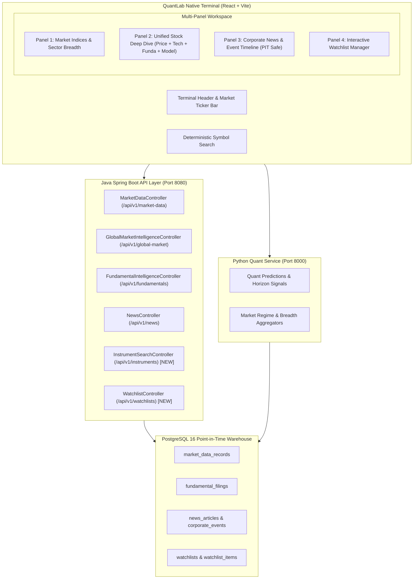

# FinceptTerminal Reference Analysis & Native QuantLab Integration Blueprint

**Reference Project**: [Fincept-Corporation/FinceptTerminal](https://github.com/Fincept-Corporation/FinceptTerminal)  
**Target Project**: QuantLab (`E:/VS CODE MAIN/PROJECTS/Quant-lab`)  
**Phase**: Phase 9 — Clean-Room Market Intelligence Terminal Architecture  
**Date**: September 2026  

---

## 1. Executive Summary

FinceptTerminal is a native desktop financial analytics application implemented in C++20 and Qt6 with an embedded Python 3.11 runtime. It is structured around multi-panel financial research desks covering global markets, equity analytics, macroeconomic indicators, news intelligence, and AI agents.

QuantLab is a web-based, dual-engine quantitative intelligence platform designed specifically for the Indian equity market (NSE/BSE). QuantLab features a Java Spring Boot backend for real-time market data, broker order execution, and point-in-time relational persistence, coupled with a Python FastAPI service for statistical learning, walk-forward validation, and factor research.

This analysis extracts key architectural patterns from FinceptTerminal—specifically information-dense financial dashboards, unified stock workspaces, multi-panel layout management, and point-in-time corporate news timelines—and maps them to native, clean-room QuantLab components.

---

## 2. Architectural Comparison Matrix

| Domain | FinceptTerminal Reference | QuantLab Native Architecture |
| :--- | :--- | :--- |
| **Platform Target** | Native Desktop Binary (Windows/Linux/macOS) via Qt6 | Modern Web SPA (React 18 + Vite + Tailwind CSS) |
| **Backend / Execution** | Embedded C++20 core + Python embedded sub-interpreters | Distributed Microservices: Java 21 Spring Boot + Python 3.11 FastAPI |
| **Persistence** | Local SQLite, local JSON caches | Enterprise PostgreSQL 16 Warehouse + Redis Cache |
| **Market Focus** | Global multi-asset (US Equities, Global Macro, Crypto, Forex) | Indian Capital Markets (NSE/BSE Equities, F&O, Indian Macro, FII/DII) |
| **Data Integrity & PIT** | Best-effort live feeds (FRED, AkShare, IMF, CCXT) | Strict Point-in-Time (PIT) with `information_available_at` and `source_timestamp` |
| **Trading Architecture** | Direct broker plugins, visual node editor | Dual Engine: Paper Trading Simulation + Safe Broker Abstraction with fail-closed timeout reconciliation |
| **Licensing** | AGPL-3.0 (Open Source) / Proprietary (Enterprise) | Clean-Room Native Implementation (Zero copyleft obligations) |

---

## 3. UI/UX & Workflow Observations

1. **Multi-Panel Terminal Composition**:
   - FinceptTerminal organizes workflows into modular desks: Market Overview, Company Equity Research, News Intelligence, Quant Lab, Macro Trends, and Watchlists.
   - Panels are structured to provide high information density without unnecessary decorative whitespace.
2. **Unified Stock Research Workspace**:
   - When a security is selected, the workspace aggregates price charts, technical features, fundamental health scores, financial statements, and recent corporate filings in a single synchronized view.
3. **News & Event Intelligence Timeline**:
   - Corporate disclosures, regulatory filings, and news articles are organized chronologically, allowing researchers to correlate price action with external narrative events.
4. **Interactive Watchlists**:
   - Quick-access symbol lists with real-time status badges, price movement indicators, and fast navigation into detailed analysis.

---

## 4. Gap Analysis for QuantLab

### Current QuantLab State (Pre-Phase 9)
- Strong backend foundation: Java Spring Boot has endpoints for market data quotes, fundamental ratios, global macro regimes, technical indicators, institutional flows, and news timelines.
- Frontend has separate discrete pages (`/markets`, `/stock/:symbol`, `/market-pulse`, `/institutional`, `/ai-research`, `/monitoring`).
- **Gaps Identified**:
  1. Lack of a unified, high-density **Market Intelligence Terminal** page that combines live index tickers, sector heatmaps, stock research, news intelligence, and interactive watchlists in a single multi-panel workspace.
  2. The frontend lacked a unified symbol search/lookup dialog that searches by symbol, company name, sector, and exchange without fuzzy misidentification.
  3. No backend Watchlist management API existed (entity was present in Java without service/controller layer or REST endpoints).
  4. Stock Analysis views were split across multiple separate sub-pages without synchronized as-of context or unified terminal navigation.

---

## 5. Architectural Blueprint for QuantLab Native Terminal

---

## 6. Detailed Concept Adoption Mapping

### Concept 1: High-Density Market Overview & Index Tickers
- **Reference Concept**: Fincept global market dashboard with multi-index ticker ribbons and sector performance.
- **QuantLab Native Equivalent**: `MarketOverviewPanel` displaying NIFTY 50, SENSEX, BANKNIFTY, INDIA VIX, US 10Y, DXY, CRUDE, and GOLD with real `source`, `source_timestamp`, and `freshness_status`.
- **Why It Helps**: Eliminates context-switching; allows quant researchers to evaluate macro and index conditions at a glance.
- **Backend Connected**: `GlobalMarketIntelligenceController` & `MarketDataController`.

### Concept 2: Unified Stock Research Workspace
- **Reference Concept**: Fincept equity research tab integrating price charts, technicals, financial statements, and valuation models.
- **QuantLab Native Equivalent**: `StockResearchPanel` combining historical candlestick charts, technical indicators (RSI, MACD, Bollinger), fundamental health metrics, quarterly statements, and quantitative signal probabilities.
- **Why It Helps**: Synthesizes fundamental, technical, and model intelligence into a cohesive decision view.
- **Backend Connected**: `MarketDataController`, `TechnicalFeatureController`, `FundamentalIntelligenceController`, `SignalController`.

### Concept 3: Point-in-Time News & Corporate Event Stream
- **Reference Concept**: Fincept news and sentiment monitor.
- **QuantLab Native Equivalent**: `NewsIntelligencePanel` rendering corporate disclosures, board meetings, and news articles with strict separation of `published_at`, `information_available_at`, and `source`.
- **Why It Helps**: Prevents look-ahead bias in research; shows the exact narrative available to market participants at any historical timestamp.
- **Backend Connected**: `NewsController`.

### Concept 4: Watchlist & Security Discovery
- **Reference Concept**: Fincept symbol screener and watchlists.
- **QuantLab Native Equivalent**: `WatchlistController` + `InstrumentSearchController` supporting exact symbol matching, company name lookup, and multi-list organization.
- **Why It Helps**: Allows quants to curate custom baskets of equities and track model signals across their universe.
- **Backend Connected**: New `WatchlistService` and `InstrumentSearchService` in Java Spring Boot.

---

## 7. Concepts Intentionally Rejected / Out of Scope

1. **Native Desktop Windowing Framework (Qt6 / C++)**: QuantLab is built as an enterprise web application (React + Spring Boot); rewriting in desktop C++ would fragment the codebase and discard web accessibility.
2. **Unvalidated Global Public Connectors (100+ Free Feeds)**: Adding unvetted external APIs without point-in-time guarantees or Indian equity coverage introduces data contamination.
3. **Crypto / Maritime / Geopolitics Desks**: Irrelevant to Indian equity algorithmic trading; kept strictly out of scope.
4. **Visual Node Editor / Drag-and-Drop Strategy Builder**: QuantLab relies on rigorous, code-based Python/Qlib alpha formulation and programmatic walk-forward backtesting.

---

## 8. Clean-Room Implementation Boundaries

- All Java code is written using Spring Data JPA, Java Records, and Spring MVC.
- All frontend components are written in React 18 TypeScript with Tailwind CSS.
- Zero copy-pasting of Fincept styles, layout CSS, or graphics.
- All data fields must handle `UNAVAILABLE` and `STALE` states gracefully without synthetic fallback injection.
